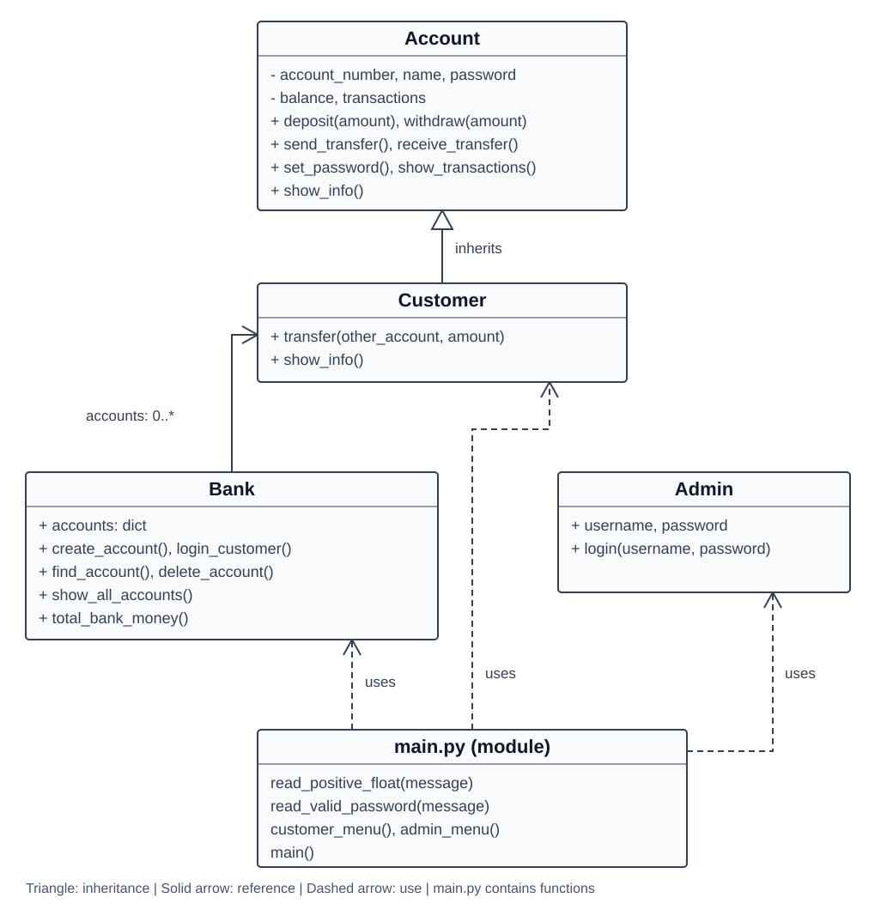

# Bank System

A console bank simulation I built while learning OOP in Python. The project separates accounts, customers, bank operations and admin login into classes, with inheritance and method overriding.

## Features

- Create a customer account and log in with an account number and password.
- Deposit and withdraw money within the available balance.
- Transfer to another account and record the operation for both accounts.
- View balances and transaction history, and change passwords.
- Let the admin list, search and delete accounts, and view the total balance.

Account numbers contain digits only and must be unique. Names cannot be blank. Passwords require at least four characters and cannot contain only spaces. Initial balances can be zero; transaction amounts must be finite and positive. Transfers to the same account are rejected.

## Run locally

Install Python 3. No external packages are required. From the project folder:

```sh
python main.py
```

Run the program in a terminal so `getpass` can hide password input.

## Files

| File | Responsibility |
| --- | --- |
| account.py | Account data, balance operations and transaction history. |
| customer.py | Customer inherits from Account and provides transfers. |
| bank.py | Account dictionary, creation, login, lookup, deletion and totals. |
| admin.py | Demo admin credentials and login checks. |
| main.py | Menu functions, input helpers and the entry point. |

## UML

`main.py` is a module containing functions, rather than a class.



## Project scope

This is an educational simulation. Accounts and transactions are stored in memory and disappear when the program exits. Customer passwords are plain text in memory. There is no database or real payment processing.

## Author

Adham Muayad Hashem
